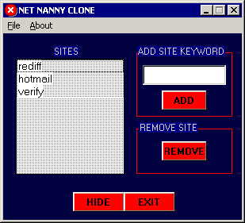



## Venki Net Nanny clone

### Description

It is a simpe Net Nanny like application which takes the browsers(microsoft internet explorer and netscape) title bar text and checks whether it contains the keywords you have added in the net nanny clone list. If it is found the app closes the browser window. Initially the applcation is invisible and can be made visible by typing "NETNANNY" anywhere on the system (even on desktop). It creates a log file on restricted web sites visited with date and time. it uses simple encrytion. The app also starts everytime System starts up by writing to startup registry. Please give useful comments
 
### More Info
 
Just run application. It is initially invisible and can be made visible by typing "NETNANNY" anywhere on the system (even on desktop).

             |
---                |---
**Submitted On**   |2002-09-11 20:53:00
**By**             |[Venkatesh K](https://github.com/Planet-Source-Code/PSCIndex/blob/master/ByAuthor/venkatesh-k.md)
**Level**          |Beginner
**User Rating**    |4.0 (20 globes from 5 users)
**Compatibility**  |VB 5\.0, VB 6\.0
**Category**       |[Complete Applications](https://github.com/Planet-Source-Code/PSCIndex/blob/master/ByCategory/complete-applications__1-27.md)
**World**          |[Visual Basic](https://github.com/Planet-Source-Code/PSCIndex/blob/master/ByWorld/visual-basic.md)
**Archive File**   |[Venki\_Net\_1332829192002\.zip](https://github.com/Planet-Source-Code/venkatesh-k-venki-net-nanny-clone__1-39118/archive/master.zip)

